# 2.2. Biểu đồ Use Case Tổng thể

## 2.2.1. Giới thiệu

Biểu đồ Use Case (Use Case Diagram) mô tả **các chức năng chính** của hệ thống PTIT-RMS từ **góc độ người dùng**. Biểu đồ này giúp:

✅ Xác định rõ **ai** sử dụng hệ thống (Actors)  
✅ Xác định **chức năng nào** hệ thống cung cấp (Use Cases)  
✅ Hiểu **mối quan hệ** giữa các chức năng  
✅ Phạm vi hệ thống (System Boundary)

---

## 2.2.2. PlantUML Code - Use Case Diagram

```plantuml
@startuml PTIT-RMS Use Case Diagram

' ============================================
' STYLING
' ============================================
skinparam packageStyle rectangle
skinparam usecase {
  BackgroundColor LightBlue
  BorderColor DarkBlue
  ArrowColor Black
}
skinparam actor {
  BackgroundColor LightYellow
  BorderColor DarkOrange
}

' ============================================
' ACTORS
' ============================================
:Khách hàng: as Customer
:Nhân viên Phục vụ: as Server
:Bếp trưởng: as Chef
:Thu ngân: as Cashier
:Quản lý: as Manager

' ============================================
' SYSTEM BOUNDARY
' ============================================
rectangle "Hệ thống PTIT-RMS" {
  
  ' ============================================
  ' USE CASES - QUẢN LÝ BÀN ĂN
  ' ============================================
  package "Quản lý Bàn ăn" {
    usecase "UC01: Quản lý Bàn ăn" as UC01
    usecase "UC02: Đặt bàn trước" as UC02
    usecase "UC03: Check-in Khách hàng" as UC03
  }
  
  ' ============================================
  ' USE CASES - QUẢN LÝ KHÁCH HÀNG
  ' ============================================
  package "Quản lý Khách hàng" {
    usecase "UC04: Quản lý Thông tin\nKhách hàng" as UC04
    usecase "UC05: Xem Lịch sử\nĐơn hàng" as UC05
  }
  
  ' ============================================
  ' USE CASES - QUẢN LÝ THỰC ĐƠN
  ' ============================================
  package "Quản lý Thực đơn" {
    usecase "UC06: Quản lý Món ăn" as UC06
    usecase "UC07: Tra cứu Món ăn" as UC07
    usecase "UC08: Quản lý Danh mục" as UC08
  }
  
  ' ============================================
  ' USE CASES - QUẢN LÝ ĐƠN HÀNG
  ' ============================================
  package "Quản lý Đơn hàng" {
    usecase "UC09: Tạo Đơn hàng" as UC09
    usecase "UC10: Cập nhật\nTrạng thái Đơn hàng" as UC10
    usecase "UC11: Hủy Đơn hàng" as UC11
    usecase "UC12: Xem Chi tiết\nĐơn hàng" as UC12
  }
  
  ' ============================================
  ' USE CASES - QUẢN LÝ TỒN KHO
  ' ============================================
  package "Quản lý Tồn kho" {
    usecase "UC13: Quản lý Nguyên liệu" as UC13
    usecase "UC14: Nhập kho" as UC14
    usecase "UC15: Xuất kho" as UC15
    usecase "UC16: Cảnh báo Hết hàng" as UC16
  }
  
  ' ============================================
  ' USE CASES - THANH TOÁN
  ' ============================================
  package "Thanh toán" {
    usecase "UC17: Xử lý Thanh toán" as UC17
    usecase "UC18: Xuất Hóa đơn" as UC18
    usecase "UC19: Áp dụng Giảm giá" as UC19
  }
  
  ' ============================================
  ' USE CASES - BÁO CÁO
  ' ============================================
  package "Báo cáo & Thống kê" {
    usecase "UC20: Báo cáo Doanh thu" as UC20
    usecase "UC21: Báo cáo Tồn kho" as UC21
    usecase "UC22: Báo cáo Hiệu suất\nNhân viên" as UC22
    usecase "UC23: Xem Dashboard" as UC23
  }
  
  ' ============================================
  ' COMMON USE CASES (INCLUDED)
  ' ============================================
  usecase "Xác thực Đăng nhập" as Login
  usecase "Kiểm tra Quyền hạn" as CheckPermission
  usecase "Gửi Thông báo" as Notify
  usecase "Tự động Trừ\nNguyên liệu" as AutoDeduct
}

' ============================================
' ACTOR - USE CASE ASSOCIATIONS
' ============================================

' Khách hàng
Customer --> UC02
Customer --> UC07

' Nhân viên Phục vụ (Server)
Server --> UC01
Server --> UC02
Server --> UC03
Server --> UC04
Server --> UC07
Server --> UC09
Server --> UC10
Server --> UC12

' Bếp trưởng (Chef)
Chef --> UC06
Chef --> UC10
Chef --> UC13
Chef --> UC14
Chef --> UC15
Chef --> UC16

' Thu ngân (Cashier)
Cashier --> UC12
Cashier --> UC17
Cashier --> UC18
Cashier --> UC19

' Quản lý (Manager)
Manager --> UC01
Manager --> UC04
Manager --> UC06
Manager --> UC08
Manager --> UC11
Manager --> UC13
Manager --> UC20
Manager --> UC21
Manager --> UC22
Manager --> UC23

' ============================================
' RELATIONSHIPS
' ============================================

' <<include>> relationships
UC09 ..> Login : <<include>>
UC10 ..> Login : <<include>>
UC17 ..> Login : <<include>>
UC20 ..> Login : <<include>>

UC09 ..> CheckPermission : <<include>>
UC06 ..> CheckPermission : <<include>>
UC13 ..> CheckPermission : <<include>>

UC09 ..> AutoDeduct : <<include>>
UC10 ..> Notify : <<include>>
UC16 ..> Notify : <<include>>
UC17 ..> UC18 : <<include>>

' <<extend>> relationships
UC19 ..> UC17 : <<extend>>
UC11 ..> UC09 : <<extend>>
UC05 ..> UC04 : <<extend>>

' Generalization (Inheritance)
UC14 --|> UC13
UC15 --|> UC13

@enduml
```



---

## 2.2.3. Mô tả ASCII Art (Alternative)

```
                          ╔══════════════════════════════════════════════════════╗
                          ║         HỆ THỐNG QUẢN LÝ NHÀ HÀNG PTIT              ║
                          ╚══════════════════════════════════════════════════════╝

     Khách hàng                Nhân viên           Bếp trưởng         Thu ngân           Quản lý
         👤                      Phục vụ               👨‍🍳               💰               👔
          │                        👤                   │                │                │
          │                        │                    │                │                │
          ├────────────────────────┼────────────────────┤                │                │
          │    ╔═══════════════════╧══════════════════╗ │                │                │
          │    ║    QUẢN LÝ BÀN ĂN & KHÁCH HÀNG       ║ │                │                │
          │    ╚═══════════════════╦══════════════════╝ │                │                │
          │                        │                    │                │                │
          ├──► UC01: Quản lý Bàn   ├───────────────────┼────────────────┼───────────────►│
          │                        │                    │                │                │
          ├──► UC02: Đặt bàn ◄─────┤                    │                │                │
          │                        │                    │                │                │
          │    UC03: Check-in ◄────┤                    │                │                │
          │                        │                    │                │                │
          │    UC04: QL Khách ◄────┼───────────────────┼────────────────┼───────────────►│
          │                        │                    │                │                │
          │    UC05: Lịch sử       │                    │                │                │
          │    (extend UC04)       │                    │                │                │
          │                        │                    │                │                │
          │    ╔═══════════════════╧══════════════════╗ │                │                │
          │    ║       QUẢN LÝ THỰC ĐƠN               ║ │                │                │
          │    ╚═══════════════════╦══════════════════╝ │                │                │
          │                        │                    │                │                │
          ├──► UC07: Tra cứu Món ◄─┼───────────────────►├────────────────┼───────────────►│
          │                        │                    │                │                │
          │    UC06: QL Món ăn ◄───┤                    │                │                │
          │                        │                    ├───────────────►│                │
          │    UC08: QL Danh mục   │                    │                │                │
          │                        │                    │                │                │
          │    ╔═══════════════════╧══════════════════╗ │                │                │
          │    ║       QUẢN LÝ ĐƠN HÀNG                ║ │                │                │
          │    ╚═══════════════════╦══════════════════╝ │                │                │
          │                        │                    │                │                │
          │    UC09: Tạo Đơn ◄─────┤                    │                │                │
          │        │               │                    │                │                │
          │        ├──(include)────┼──► [Đăng nhập]     │                │                │
          │        ├──(include)────┼──► [Check Quyền]   │                │                │
          │        └──(include)────┼──► [Trừ NL]        │                │                │
          │                        │                    │                │                │
          │    UC10: Cập nhật  ◄───┼───────────────────►│                │                │
          │                        │                    │                │                │
          │    UC11: Hủy Đơn       │                    │                │                │
          │    (extend UC09)       │                    │                │                │
          │                        │                    │                │                │
          │    UC12: Xem Chi tiết◄─┤                    │                ├───────────────►│
          │                        │                    │                │                │
          │    ╔═══════════════════╧══════════════════╗ │                │                │
          │    ║       QUẢN LÝ TỒN KHO                 ║ │                │                │
          │    ╚═══════════════════╦══════════════════╝ │                │                │
          │                        │                    │                │                │
          │    UC13: QL Nguyên liệu│                   ┌┴─────────────┐  │                │
          │                        │                   │              │  │                │
          │    UC14: Nhập kho ─────┤                   │  UC13: QL    │  │                │
          │    (generalization)    │                   │  Nguyên liệu │  │                │
          │                        │                   │              │  │                │
          │    UC15: Xuất kho ─────┤                   └┬─────────────┘  │                │
          │    (generalization)    │                    │                │                │
          │                        │                    │                │                │
          │    UC16: Cảnh báo ◄────┤                    │                │                │
          │        │               │                    │                │                │
          │        └──(include)────┼──► [Gửi Thông báo]│                │                │
          │                        │                    │                │                │
          │    ╔═══════════════════╧══════════════════╗ │                │                │
          │    ║          THANH TOÁN                   ║ │                │                │
          │    ╚═══════════════════╦══════════════════╝ │                │                │
          │                        │                    │                │                │
          │    UC17: Thanh toán ◄──┼───────────────────┼───────────────►│                │
          │        │               │                    │                │                │
          │        ├──(include)────┼──► [Đăng nhập]     │                │                │
          │        └──(include)────┼──► UC18: Xuất HĐ   │                │                │
          │                        │                    │                │                │
          │    UC19: Giảm giá ─────┤                    │                │                │
          │    (extend UC17)       │                    │                │                │
          │                        │                    │                │                │
          │    ╔═══════════════════╧══════════════════╗ │                │                │
          │    ║       BÁO CÁO & THỐNG KÊ              ║ │                │                │
          │    ╚═══════════════════╦══════════════════╝ │                │                │
          │                        │                    │                │                │
          │    UC20: BC Doanh thu ─┤                    │                │                │
          │                        │                    │                │                │
          │    UC21: BC Tồn kho ───┤                    │                │                │
          │                        │                    │                │                │
          │    UC22: BC Hiệu suất ─┤                    │                │                │
          │                        │                    │                │                │
          │    UC23: Dashboard ◄───┼───────────────────┼────────────────┼───────────────►│
          │                        │                    │                │                │
          └────────────────────────┴────────────────────┴────────────────┴────────────────┘
```

---

## 2.2.4. Danh sách Actors (Nhân vật)

Hệ thống PTIT-RMS có **5 Actors chính**:

| STT | Actor | Vai trò | Mô tả |
|-----|-------|---------|-------|
| 1 | **Khách hàng<br/>(Customer)** | Người sử dụng dịch vụ | - Đặt bàn trước qua website<br/>- Tra cứu thực đơn<br/>- Không cần đăng nhập (optional)<br/>- Nhận hóa đơn qua email/SMS |
| 2 | **Nhân viên Phục vụ<br/>(Server)** | Người phục vụ tại nhà hàng | - Quản lý bàn ăn<br/>- Đón tiếp khách, check-in<br/>- Tạo đơn hàng, gọi món<br/>- Cập nhật trạng thái đơn<br/>- Xem lịch sử khách hàng |
| 3 | **Bếp trưởng<br/>(Chef)** | Người quản lý bếp | - Xem đơn hàng mới (Kitchen Display)<br/>- Cập nhật trạng thái món (Đang làm → Xong)<br/>- Quản lý thực đơn (thêm/sửa/xóa món)<br/>- Quản lý nguyên liệu, nhập/xuất kho<br/>- Nhận cảnh báo nguyên liệu sắp hết |
| 4 | **Thu ngân<br/>(Cashier)** | Người thu tiền | - Xem chi tiết đơn hàng<br/>- Xử lý thanh toán (Tiền mặt, Thẻ, Ví điện tử)<br/>- Áp dụng mã giảm giá<br/>- Xuất hóa đơn (In hoặc Email)<br/>- Đối soát cuối ca |
| 5 | **Quản lý<br/>(Manager)** | Người quản lý nhà hàng | - Tất cả chức năng của Server, Chef, Cashier<br/>- Quản lý thông tin nhân viên<br/>- Xem tất cả báo cáo (Doanh thu, Tồn kho, Hiệu suất)<br/>- Phê duyệt hủy đơn hàng<br/>- Cấu hình hệ thống |

### Phân cấp Actors (Hierarchy)

```
                     ┌───────────┐
                     │  Manager  │ (Quyền cao nhất)
                     └─────┬─────┘
                           │
           ┌───────────────┼───────────────┐
           │               │               │
      ┌────▼────┐     ┌────▼────┐     ┌───▼────┐
      │  Server │     │  Chef   │     │Cashier │
      └─────────┘     └─────────┘     └────────┘
           │               │               │
           └───────────────┴───────────────┘
                           │
                      ┌────▼────┐
                      │Customer │ (Quyền thấp nhất)
                      └─────────┘
```

**Lưu ý:** 
- Manager có thể thực hiện tất cả Use Cases của các Actor khác
- Customer không cần đăng nhập (hoặc đăng nhập optional)
- Server, Chef, Cashier, Manager phải đăng nhập

---

## 2.2.5. Danh sách Use Cases Chi tiết

### Nhóm 1: Quản lý Bàn ăn & Khách hàng (5 UCs)

| ID | Tên Use Case | Mô tả ngắn | Actor | Độ ưu tiên |
|----|-------------|-----------|-------|-----------|
| **UC01** | **Quản lý Bàn ăn** | Tạo/Sửa/Xóa bàn, xem sơ đồ bàn, cập nhật trạng thái | Server, Manager | ⭐⭐⭐⭐⭐ |
| **UC02** | **Đặt bàn trước** | Khách hàng hoặc nhân viên đặt bàn cho thời gian cụ thể | Customer, Server | ⭐⭐⭐⭐ |
| **UC03** | **Check-in Khách hàng** | Xác nhận khách đến, cập nhật bàn sang "Đang phục vụ" | Server | ⭐⭐⭐⭐⭐ |
| **UC04** | **Quản lý Thông tin Khách hàng** | CRUD thông tin khách (Họ tên, SĐT, Email, Loại khách) | Server, Manager | ⭐⭐⭐ |
| **UC05** | **Xem Lịch sử Đơn hàng** | Xem lịch sử đơn hàng của khách hàng (Extend UC04) | Server, Manager | ⭐⭐⭐ |

### Nhóm 2: Quản lý Thực đơn (3 UCs)

| ID | Tên Use Case | Mô tả ngắn | Actor | Độ ưu tiên |
|----|-------------|-----------|-------|-----------|
| **UC06** | **Quản lý Món ăn** | CRUD món ăn (Tên, Giá, Hình ảnh, Công thức) | Chef, Manager | ⭐⭐⭐⭐⭐ |
| **UC07** | **Tra cứu Món ăn** | Tìm kiếm món theo tên, loại, giá; xem tình trạng còn/hết | Customer, Server, Chef | ⭐⭐⭐⭐⭐ |
| **UC08** | **Quản lý Danh mục** | Tạo/Sửa/Xóa danh mục món (Khai vị, Món chính...) | Manager | ⭐⭐⭐ |

### Nhóm 3: Quản lý Đơn hàng (4 UCs)

| ID | Tên Use Case | Mô tả ngắn | Actor | Độ ưu tiên |
|----|-------------|-----------|-------|-----------|
| **UC09** | **Tạo Đơn hàng** | Chọn bàn, thêm món, tạo đơn mới (Include: Login, CheckPermission, AutoDeduct) | Server | ⭐⭐⭐⭐⭐ |
| **UC10** | **Cập nhật Trạng thái Đơn hàng** | Chuyển trạng thái: Preparing → Ready → Serving → Completed | Server, Chef | ⭐⭐⭐⭐⭐ |
| **UC11** | **Hủy Đơn hàng** | Hủy đơn với lý do, cần phê duyệt Manager (Extend UC09) | Manager | ⭐⭐⭐⭐ |
| **UC12** | **Xem Chi tiết Đơn hàng** | Xem thông tin đơn: Món, Số lượng, Giá, Trạng thái | Server, Cashier, Manager | ⭐⭐⭐⭐⭐ |

### Nhóm 4: Quản lý Tồn kho (4 UCs)

| ID | Tên Use Case | Mô tả ngắn | Actor | Độ ưu tiên |
|----|-------------|-----------|-------|-----------|
| **UC13** | **Quản lý Nguyên liệu** | CRUD nguyên liệu (Tên, ĐVT, Tồn kho, Ngưỡng cảnh báo) | Chef, Manager | ⭐⭐⭐⭐⭐ |
| **UC14** | **Nhập kho** | Nhập nguyên liệu mới vào kho (Generalization của UC13) | Chef | ⭐⭐⭐⭐ |
| **UC15** | **Xuất kho** | Xuất nguyên liệu thủ công (Generalization của UC13) | Chef | ⭐⭐⭐ |
| **UC16** | **Cảnh báo Hết hàng** | Tự động cảnh báo khi nguyên liệu < ngưỡng (Include: Notify) | Hệ thống | ⭐⭐⭐⭐ |

### Nhóm 5: Thanh toán (3 UCs)

| ID | Tên Use Case | Mô tả ngắn | Actor | Độ ưu tiên |
|----|-------------|-----------|-------|-----------|
| **UC17** | **Xử lý Thanh toán** | Thanh toán đơn hàng (Tiền mặt, Thẻ, Ví điện tử) (Include: UC18) | Cashier | ⭐⭐⭐⭐⭐ |
| **UC18** | **Xuất Hóa đơn** | Tạo và in/gửi hóa đơn cho khách (Included by UC17) | Cashier | ⭐⭐⭐⭐⭐ |
| **UC19** | **Áp dụng Giảm giá** | Áp dụng voucher/mã giảm giá (Extend UC17) | Cashier | ⭐⭐⭐ |

### Nhóm 6: Báo cáo & Thống kê (4 UCs)

| ID | Tên Use Case | Mô tả ngắn | Actor | Độ ưu tiên |
|----|-------------|-----------|-------|-----------|
| **UC20** | **Báo cáo Doanh thu** | Xem doanh thu theo ngày/tháng/quý, biểu đồ | Manager | ⭐⭐⭐⭐⭐ |
| **UC21** | **Báo cáo Tồn kho** | Xem báo cáo Nhập-Xuất-Tồn nguyên liệu | Manager | ⭐⭐⭐⭐ |
| **UC22** | **Báo cáo Hiệu suất Nhân viên** | Xem số bàn phục vụ, doanh thu theo nhân viên | Manager | ⭐⭐⭐ |
| **UC23** | **Xem Dashboard** | Xem tổng quan: Doanh thu hôm nay, Bàn đang phục vụ, Cảnh báo | Manager | ⭐⭐⭐⭐⭐ |

### Use Cases Hỗ trợ (Included/Extended)

| Tên | Loại | Mô tả |
|-----|------|-------|
| **Xác thực Đăng nhập** | Included | Kiểm tra JWT token, session |
| **Kiểm tra Quyền hạn** | Included | RBAC - kiểm tra role (Server, Chef, Cashier, Manager) |
| **Gửi Thông báo** | Included | Gửi notification (WebSocket, Email, SMS) |
| **Tự động Trừ Nguyên liệu** | Included | Tự động trừ nguyên liệu khi tạo đơn hàng |

**Tổng số:** **23 Use Cases** (19 chính + 4 hỗ trợ)

---

## 2.2.6. Giải thích Mối quan hệ

### A. Association (Liên kết)

**Ký hiệu:** `--->`  
**Ý nghĩa:** Actor có thể thực hiện Use Case này

**Ví dụ:**
```
Server --> UC09 (Tạo Đơn hàng)
```
→ Nhân viên phục vụ có thể tạo đơn hàng mới

### B. Include (Bao hàm)

**Ký hiệu:** `..> <<include>>`  
**Ý nghĩa:** Use Case A **bắt buộc phải** gọi Use Case B để hoàn thành

**Đặc điểm:**
- Use Case B là **bước bắt buộc** trong Use Case A
- Use Case B có thể được **tái sử dụng** bởi nhiều Use Case khác
- Mũi tên chỉ từ Use Case gọi → Use Case được gọi

**Ví dụ trong PTIT-RMS:**

```
UC09 (Tạo Đơn hàng) ..> Xác thực Đăng nhập : <<include>>
UC09 (Tạo Đơn hàng) ..> Kiểm tra Quyền hạn : <<include>>
UC09 (Tạo Đơn hàng) ..> Tự động Trừ Nguyên liệu : <<include>>
```

**Giải thích:**
1. **UC09 → Xác thực Đăng nhập**: 
   - Trước khi tạo đơn, hệ thống **bắt buộc** phải kiểm tra user đã đăng nhập chưa
   - Nếu chưa đăng nhập → Redirect về trang login
   
2. **UC09 → Kiểm tra Quyền hạn**: 
   - Sau khi đăng nhập, hệ thống **bắt buộc** phải kiểm tra user có quyền tạo đơn không
   - Chỉ Server và Manager mới được phép tạo đơn
   
3. **UC09 → Tự động Trừ Nguyên liệu**: 
   - Sau khi tạo đơn thành công, hệ thống **bắt buộc** phải trừ nguyên liệu trong kho
   - Nếu không đủ nguyên liệu → Báo lỗi và rollback

**Các Include khác:**
```
UC17 (Thanh toán) ..> Xác thực Đăng nhập : <<include>>
UC17 (Thanh toán) ..> UC18 (Xuất Hóa đơn) : <<include>>
UC16 (Cảnh báo Hết hàng) ..> Gửi Thông báo : <<include>>
UC10 (Cập nhật Trạng thái) ..> Gửi Thông báo : <<include>>
```

**Lợi ích của Include:**
- ✅ **Tái sử dụng code**: "Xác thực Đăng nhập" được dùng bởi nhiều UC
- ✅ **Tách biệt logic**: Logic xác thực được tách riêng, dễ bảo trì
- ✅ **Consistency**: Đảm bảo tất cả UC đều kiểm tra đăng nhập theo cách giống nhau

### C. Extend (Mở rộng)

**Ký hiệu:** `..> <<extend>>`  
**Ý nghĩa:** Use Case B là **chức năng tùy chọn** có thể mở rộng Use Case A

**Đặc điểm:**
- Use Case B chỉ thực thi trong **điều kiện nhất định** (extension point)
- Use Case A có thể hoàn thành mà **không cần** Use Case B
- Mũi tên chỉ từ Use Case mở rộng → Use Case gốc (ngược với Include)

**Ví dụ trong PTIT-RMS:**

```
UC19 (Áp dụng Giảm giá) ..> UC17 (Thanh toán) : <<extend>>
UC11 (Hủy Đơn hàng) ..> UC09 (Tạo Đơn hàng) : <<extend>>
UC05 (Xem Lịch sử) ..> UC04 (Quản lý Khách hàng) : <<extend>>
```

**Giải thích:**

1. **UC19 → UC17 (Áp dụng Giảm giá extends Thanh toán)**:
   ```
   Luồng chính UC17 (Thanh toán):
   1. Thu ngân chọn đơn hàng
   2. Hệ thống hiển thị tổng tiền
   3. [Extension Point: Áp dụng giảm giá] ← UC19 có thể xen vào đây
   4. Thu ngân chọn phương thức thanh toán
   5. Hệ thống xử lý thanh toán
   6. In hóa đơn
   
   Luồng mở rộng UC19 (nếu có mã giảm giá):
   3a. Thu ngân nhập mã giảm giá
   3b. Hệ thống kiểm tra mã hợp lệ
   3c. Hệ thống tính lại tổng tiền sau giảm
   3d. Quay lại bước 4
   ```
   
   → Thanh toán có thể hoàn tất **mà không cần** áp dụng giảm giá

2. **UC11 → UC09 (Hủy Đơn extends Tạo Đơn hàng)**:
   ```
   Luồng chính UC09 (Tạo Đơn hàng):
   1. Server chọn bàn
   2. Server thêm món vào đơn
   3. Hệ thống tính tổng tiền
   4. Server xác nhận tạo đơn
   5. Hệ thống tạo đơn thành công
   
   Luồng mở rộng UC11 (nếu cần hủy):
   [Extension Point: Sau khi tạo đơn]
   6a. Manager muốn hủy đơn
   6b. Manager nhập lý do hủy
   6c. Hệ thống hủy đơn, hoàn nguyên nguyên liệu
   ```
   
   → Hầu hết đơn hàng được tạo thành công, chỉ **một số trường hợp** cần hủy

3. **UC05 → UC04 (Xem Lịch sử extends Quản lý Khách hàng)**:
   ```
   Luồng chính UC04 (Quản lý Khách hàng):
   1. Server tìm kiếm khách hàng
   2. Hệ thống hiển thị thông tin cơ bản
   3. Server có thể sửa thông tin
   
   Luồng mở rộng UC05 (nếu muốn xem lịch sử):
   [Extension Point: Sau khi hiển thị thông tin]
   2a. Server click "Xem lịch sử"
   2b. Hệ thống hiển thị các đơn hàng trước đó
   2c. Server xem chi tiết từng đơn
   ```
   
   → Quản lý khách hàng thường chỉ cần xem/sửa thông tin cơ bản, **không phải lúc nào cũng** xem lịch sử

**Extension Point (Điểm mở rộng):**

Extension point là **thời điểm cụ thể** trong luồng chính mà Use Case mở rộng có thể xen vào.

```
Use Case: UC17 - Thanh toán
Extension Points:
  - "Áp dụng giảm giá" at step 3 (sau khi hiển thị tổng tiền)
  
Use Case: UC09 - Tạo Đơn hàng  
Extension Points:
  - "Hủy đơn hàng" at step 5 (sau khi tạo đơn thành công)
```

**Lợi ích của Extend:**
- ✅ **Tùy chọn**: Chức năng bổ sung không làm phức tạp luồng chính
- ✅ **Linh hoạt**: Dễ dàng thêm chức năng mới mà không sửa Use Case gốc
- ✅ **Separation of concerns**: Tách biệt logic chính và logic tùy chọn

### D. Generalization (Kế thừa/Tổng quát hóa)

**Ký hiệu:** `--|>` (mũi tên tam giác rỗng)  
**Ý nghĩa:** Use Case con **kế thừa** toàn bộ hành vi của Use Case cha, và có thể thêm hành vi riêng

**Đặc điểm:**
- Use Case con là **trường hợp cụ thể** của Use Case cha
- Use Case con thực hiện **tất cả** các bước của Use Case cha + các bước riêng
- Tương tự kế thừa trong OOP

**Ví dụ trong PTIT-RMS:**

```
UC14 (Nhập kho) --|> UC13 (Quản lý Nguyên liệu)
UC15 (Xuất kho) --|> UC13 (Quản lý Nguyên liệu)
```

**Giải thích:**

```
Use Case cha: UC13 - Quản lý Nguyên liệu
  - Xem danh sách nguyên liệu
  - Tìm kiếm nguyên liệu
  - Thêm nguyên liệu mới
  - Sửa thông tin nguyên liệu
  - Xóa nguyên liệu
  
Use Case con: UC14 - Nhập kho
  - Kế thừa tất cả chức năng của UC13
  - Thêm: Nhập số lượng nguyên liệu
  - Thêm: Ghi nhận nhà cung cấp
  - Thêm: Tạo phiếu nhập kho
  - Thêm: Cập nhật tồn kho (tăng)
  - Thêm: Log transaction "IMPORT"
  
Use Case con: UC15 - Xuất kho
  - Kế thừa tất cả chức năng của UC13
  - Thêm: Xuất số lượng nguyên liệu
  - Thêm: Kiểm tra tồn kho đủ không
  - Thêm: Tạo phiếu xuất kho
  - Thêm: Cập nhật tồn kho (giảm)
  - Thêm: Log transaction "EXPORT"
```

**Sơ đồ phân cấp:**

```
            ┌─────────────────────────────┐
            │  UC13: Quản lý Nguyên liệu  │ (Use Case cha - General)
            │  - Xem danh sách            │
            │  - Tìm kiếm                 │
            │  - CRUD nguyên liệu         │
            └──────────────┬──────────────┘
                           │
             ┌─────────────┴─────────────┐
             │                           │
      ┌──────▼──────┐             ┌──────▼──────┐
      │ UC14: Nhập  │             │ UC15: Xuất  │ (Use Cases con - Specific)
      │     kho     │             │     kho     │
      │             │             │             │
      │ + Nhập SL   │             │ + Xuất SL   │
      │ + Nhà CC    │             │ + Check TK  │
      │ + Phiếu nhập│             │ + Phiếu xuất│
      │ + Tăng TK   │             │ + Giảm TK   │
      └─────────────┘             └─────────────┘
```

**Lợi ích của Generalization:**
- ✅ **Code reuse**: Tránh trùng lặp logic chung
- ✅ **Polymorphism**: Có thể xử lý UC14, UC15 như UC13
- ✅ **Maintainability**: Sửa logic chung ở Use Case cha → tất cả Use Case con được cập nhật

### E. So sánh Include vs Extend vs Generalization

| Tiêu chí | Include | Extend | Generalization |
|----------|---------|--------|----------------|
| **Mối quan hệ** | "Sử dụng" | "Tùy chọn mở rộng" | "Là một loại của" |
| **Bắt buộc?** | ✅ Bắt buộc | ❌ Tùy chọn | ✅ Bắt buộc (nếu dùng UC con) |
| **Chiều mũi tên** | Từ UC gọi → UC được gọi | Từ UC mở rộng → UC gốc | Từ UC con → UC cha |
| **Khi nào dùng?** | Logic chung được tái sử dụng | Chức năng bổ sung, không phải lúc nào cũng cần | UC con là trường hợp cụ thể của UC cha |
| **Ví dụ** | Tạo Đơn **include** Đăng nhập | Giảm giá **extend** Thanh toán | Nhập kho **generalize** Quản lý NL |
| **Trong code** | Gọi function | If-else, switch-case | Inheritance, Polymorphism |

**Ví dụ code minh họa:**

```typescript
// INCLUDE
class CreateOrderUseCase {
  async execute(data) {
    // Bắt buộc gọi
    await this.authService.authenticate(); // Include: Login
    await this.authService.checkPermission('CREATE_ORDER'); // Include: Check Permission
    
    const order = await this.orderService.create(data);
    
    // Bắt buộc gọi
    await this.inventoryService.deduct(order.items); // Include: Auto Deduct
    
    return order;
  }
}

// EXTEND
class ProcessPaymentUseCase {
  async execute(orderId, paymentData) {
    let total = await this.calculateTotal(orderId);
    
    // Tùy chọn - chỉ khi có voucher
    if (paymentData.voucherCode) {
      total = await this.applyDiscount(total, paymentData.voucherCode); // Extend: Apply Discount
    }
    
    const payment = await this.paymentService.process(total);
    return payment;
  }
}

// GENERALIZATION
class ManageIngredientUseCase {
  // Logic chung
  async list() { ... }
  async search() { ... }
  async create() { ... }
  async update() { ... }
  async delete() { ... }
}

class ImportIngredientUseCase extends ManageIngredientUseCase {
  // Kế thừa tất cả method từ cha
  
  // Thêm logic riêng
  async import(ingredientId, quantity, supplier) {
    // Kiểm tra nguyên liệu tồn tại (dùng method cha)
    const ingredient = await this.findById(ingredientId);
    
    // Logic riêng của Import
    ingredient.stockQuantity += quantity;
    await this.update(ingredient);
    
    await this.createImportTransaction({
      ingredientId,
      quantity,
      supplier,
      type: 'IMPORT'
    });
  }
}

class ExportIngredientUseCase extends ManageIngredientUseCase {
  // Thêm logic riêng cho Export
  async export(ingredientId, quantity) {
    const ingredient = await this.findById(ingredientId);
    
    if (ingredient.stockQuantity < quantity) {
      throw new Error('Insufficient stock');
    }
    
    ingredient.stockQuantity -= quantity;
    await this.update(ingredient);
    
    await this.createExportTransaction({
      ingredientId,
      quantity,
      type: 'EXPORT'
    });
  }
}
```

---

## 2.2.7. Traceability Matrix (Ma trận Truy vết)

Bảng này cho thấy **Use Case nào** liên quan đến **Actor nào** và **Yêu cầu Nghiệp vụ nào**.

| Use Case | Customer | Server | Chef | Cashier | Manager | Yêu cầu Nghiệp vụ |
|----------|----------|--------|------|---------|---------|-------------------|
| UC01: Quản lý Bàn ăn | | ✅ | | | ✅ | BR-01: Bàn ăn |
| UC02: Đặt bàn | ✅ | ✅ | | | | BR-02: Đặt bàn |
| UC03: Check-in | | ✅ | | | | BR-03: Check-in |
| UC04: QL Khách hàng | | ✅ | | | ✅ | BR-04: Khách hàng |
| UC05: Lịch sử | | ✅ | | | ✅ | BR-04: Khách hàng |
| UC06: QL Món ăn | | | ✅ | | ✅ | BR-05: Thực đơn |
| UC07: Tra cứu Món | ✅ | ✅ | ✅ | | | BR-05: Thực đơn |
| UC08: QL Danh mục | | | | | ✅ | BR-05: Thực đơn |
| UC09: Tạo Đơn hàng | | ✅ | | | | BR-06: Đơn hàng |
| UC10: Cập nhật TT Đơn | | ✅ | ✅ | | | BR-06: Đơn hàng |
| UC11: Hủy Đơn | | | | | ✅ | BR-06: Đơn hàng |
| UC12: Xem Chi tiết | | ✅ | | ✅ | ✅ | BR-06: Đơn hàng |
| UC13: QL Nguyên liệu | | | ✅ | | ✅ | BR-07: Tồn kho |
| UC14: Nhập kho | | | ✅ | | | BR-07: Tồn kho |
| UC15: Xuất kho | | | ✅ | | | BR-07: Tồn kho |
| UC16: Cảnh báo Hết | | | ✅ | | ✅ | BR-07: Tồn kho |
| UC17: Thanh toán | | | | ✅ | | BR-08: Thanh toán |
| UC18: Xuất Hóa đơn | | | | ✅ | | BR-08: Thanh toán |
| UC19: Giảm giá | | | | ✅ | | BR-08: Thanh toán |
| UC20: BC Doanh thu | | | | | ✅ | BR-09: Báo cáo |
| UC21: BC Tồn kho | | | | | ✅ | BR-09: Báo cáo |
| UC22: BC Hiệu suất | | | | | ✅ | BR-09: Báo cáo |
| UC23: Dashboard | | | | | ✅ | BR-09: Báo cáo |

**Chú thích:**
- **BR-01**: Quản lý Bàn ăn
- **BR-02**: Đặt bàn trước
- **BR-03**: Check-in Khách hàng
- **BR-04**: Quản lý Khách hàng
- **BR-05**: Quản lý Thực đơn
- **BR-06**: Quản lý Đơn hàng
- **BR-07**: Quản lý Tồn kho
- **BR-08**: Thanh toán & Hóa đơn
- **BR-09**: Báo cáo & Thống kê

---

## 2.2.8. Độ ưu tiên Use Cases

### Phân loại theo MoSCoW

| Mức độ | Ký hiệu | Số lượng | Use Cases |
|--------|---------|----------|-----------|
| **Must Have**<br/>(Bắt buộc) | ⭐⭐⭐⭐⭐ | 11 | UC01, UC03, UC06, UC07, UC09, UC10, UC12, UC13, UC17, UC18, UC20, UC23 |
| **Should Have**<br/>(Nên có) | ⭐⭐⭐⭐ | 5 | UC02, UC11, UC14, UC16, UC21 |
| **Could Have**<br/>(Có thể có) | ⭐⭐⭐ | 7 | UC04, UC05, UC08, UC15, UC19, UC22 |

### Lộ trình Triển khai (Phased Approach)

**Phase 1: MVP (Minimum Viable Product) - 2 tháng**
```
Sprint 1-2: Core Functionality
✅ UC01: Quản lý Bàn ăn
✅ UC06: Quản lý Món ăn  
✅ UC07: Tra cứu Món ăn
✅ UC09: Tạo Đơn hàng
✅ UC10: Cập nhật Trạng thái Đơn hàng
✅ UC12: Xem Chi tiết Đơn hàng

Sprint 3-4: Payment & Inventory
✅ UC13: Quản lý Nguyên liệu
✅ UC17: Xử lý Thanh toán
✅ UC18: Xuất Hóa đơn
✅ UC23: Dashboard
```

**Phase 2: Enhanced Features - 2 tháng**
```
Sprint 5-6: Advanced Features
✅ UC02: Đặt bàn trước
✅ UC03: Check-in Khách hàng
✅ UC04: Quản lý Khách hàng
✅ UC11: Hủy Đơn hàng
✅ UC14: Nhập kho
✅ UC16: Cảnh báo Hết hàng

Sprint 7-8: Reports & Analytics
✅ UC20: Báo cáo Doanh thu
✅ UC21: Báo cáo Tồn kho
```

**Phase 3: Nice-to-have - 1-2 tháng**
```
Sprint 9-10: Additional Features
✅ UC05: Xem Lịch sử Đơn hàng
✅ UC08: Quản lý Danh mục
✅ UC15: Xuất kho
✅ UC19: Áp dụng Giảm giá
✅ UC22: Báo cáo Hiệu suất Nhân viên
```

---

## 2.2.9. Use Case Dependencies (Phụ thuộc)

Sơ đồ này cho thấy **thứ tự triển khai** hợp lý (Use Case nào phụ thuộc Use Case nào).

```
                    [Xác thực Đăng nhập] ◄────────────┐
                              │                       │
                              │ (required by all)     │
                              │                       │
            ┌─────────────────┼─────────────────┐     │
            │                 │                 │     │
      [UC01: Bàn] ──┐   [UC06: Món] ──┐  [UC13: NL]  │
            │       │         │       │         │     │
            │       │         │       │         │     │
            ▼       │         ▼       │         ▼     │
      [UC02: Đặt] ◄─┘   [UC07: Tra] ◄─┘  [UC14: Nhập]│
            │                 │               │       │
            ▼                 │               │       │
      [UC03: Check-in] ───────┼───────────────┘       │
                              │                       │
                              ▼                       │
                        [UC09: Tạo Đơn] ──────────────┘
                              │
                    ┌─────────┼─────────┐
                    │         │         │
              [UC10: Cập    [UC11:   [UC12: Xem]
               nhật TT]      Hủy]      Chi tiết]
                    │         │         │
                    └─────────┼─────────┘
                              │
                              ▼
                        [UC17: Thanh toán]
                              │
                    ┌─────────┼─────────┐
                    │         │         │
              [UC18: Hóa    [UC19:   [UC20: BC
               đơn]         Giảm giá]  Doanh thu]
                              │
                    ┌─────────┼─────────┐
                    │         │         │
              [UC21: BC    [UC22: BC  [UC23:
               Tồn kho]    NV]        Dashboard]
```

**Giải thích:**
- **Xác thực Đăng nhập**: Phải làm đầu tiên, được tất cả UC khác sử dụng
- **UC01, UC06, UC13**: Phải có trước khi tạo đơn (cần có bàn, món, nguyên liệu)
- **UC09**: Core use case, phụ thuộc vào UC01, UC06, UC13
- **UC17**: Phải có UC09 trước (có đơn hàng mới thanh toán được)
- **UC20, UC21, UC22**: Báo cáo cần có dữ liệu từ các UC trước

---

## 2.2.10. Tổng kết Biểu đồ Use Case

### Thống kê

| Tiêu chí | Số lượng |
|----------|----------|
| **Tổng số Actors** | 5 |
| **Tổng số Use Cases chính** | 23 |
| **Use Cases Must Have** | 11 |
| **Use Cases Should Have** | 5 |
| **Use Cases Could Have** | 7 |
| **Mối quan hệ Include** | 8 |
| **Mối quan hệ Extend** | 3 |
| **Mối quan hệ Generalization** | 2 |

### Checklist Hoàn thành

✅ **Biểu đồ Use Case:**
- [x] PlantUML code đầy đủ
- [x] ASCII art (alternative)
- [x] Hiển thị 5 Actors rõ ràng
- [x] Hiển thị 23 Use Cases
- [x] System boundary (Rectangle)
- [x] Grouping theo module (Package)

✅ **Actors:**
- [x] Khách hàng (Customer)
- [x] Nhân viên Phục vụ (Server)
- [x] Bếp trưởng (Chef)
- [x] Thu ngân (Cashier)
- [x] Quản lý (Manager)

✅ **Mối quan hệ:**
- [x] Association (Actor → Use Case)
- [x] Include relationships (8)
- [x] Extend relationships (3)
- [x] Generalization (2)

✅ **Documentation:**
- [x] Danh sách Use Cases chi tiết
- [x] Giải thích từng loại mối quan hệ
- [x] Ví dụ cụ thể
- [x] Code minh họa
- [x] Traceability Matrix
- [x] Độ ưu tiên & Lộ trình
- [x] Dependency diagram

### Kết luận

Biểu đồ Use Case tổng thể của PTIT-RMS đã mô tả đầy đủ:

1. **Actors**: 5 vai trò người dùng với phân quyền rõ ràng
2. **Use Cases**: 23 chức năng chính, bao phủ toàn bộ quy trình nhà hàng
3. **Relationships**: 
   - **Include**: Tái sử dụng logic chung (Đăng nhập, Kiểm tra quyền, Thông báo...)
   - **Extend**: Chức năng tùy chọn (Giảm giá, Hủy đơn, Xem lịch sử...)
   - **Generalization**: Phân cấp Use Cases (Nhập/Xuất kế thừa từ Quản lý NL)
4. **Prioritization**: Phân loại Must/Should/Could Have
5. **Dependencies**: Thứ tự triển khai hợp lý

Biểu đồ này sẽ là **nền tảng** cho các chương tiếp theo:
- **Chương 3**: Đặc tả Use Case chi tiết
- **Chương 4**: ERD & Database design
- **Chương 5**: Sequence diagrams
- **Chương 6**: Wireframes

---

**Chương tiếp theo (2.3)** sẽ trình bày **Danh sách Use Case và Mô tả tóm tắt** dạng bảng chi tiết với đầy đủ thông tin từng Use Case.